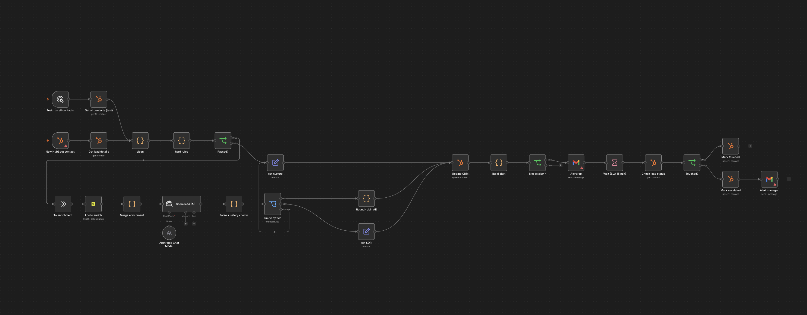
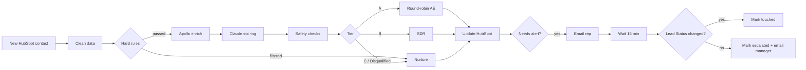

# Inbound Lead Router with Speed-to-Lead SLA

An n8n workflow that qualifies, scores and routes inbound demo requests in HubSpot, alerts the right sales rep, and escalates to a manager when nobody reacts within the SLA.

Built as a portfolio project for a fictional B2B SaaS company ("Hirelane", an ATS for companies that hire in volume). Company, people and test data are fictional; see [Test data](#test-data).

---

## The problem

Inbound demo requests sit unassigned for hours while reps spend time on leads that were never going to buy: job seekers using the demo form, staffing agencies, one-person companies. Good leads go cold, and nobody notices until it is too late.

## What it does

1. **Trigger:** A new contact is created in HubSpot (from the demo form).
2. **Clean:** Lowercases emails, extracts domains, turns dropdown bands ("500–999") into numbers, flags free email providers.
3. **Hard rules (no AI, no cost):** Removes spam, free-email leads, companies under 50 employees, and leads outside the target region.
4. **Enrich:** Looks up the company in Apollo (industry, employee count, funding stage, description) and flags a size conflict if the form and Apollo disagree.
5. **Score (Claude):** Scores the lead on a 4-part rubric and returns strict JSON with reasons and a suggested first line for the rep.
6. **Route:** Tier A goes to an Account Executive by round-robin, Tier B to the SDR, everything else to nurture.
7. **Update CRM and alert:** Writes score, tier, rep and reasons to HubSpot, then emails the assigned rep.
8. **SLA check:** Waits 15 minutes. If the rep has not changed the Lead Status, the lead is marked *Escalated* and the manager is emailed.

---

## Design decisions

**Clean first, cheap checks second, paid steps last.**
Rules run before enrichment and AI, so junk leads never cost an Apollo credit or a model call.

**Rules for the clear cases, AI only for judgment.**
A free email address does not need an LLM. Reading a message like "Can I send you my CV?" does. Job seekers with a company email and resellers are caught by the model, not by keyword lists.

**The AI never has the final word on the tier.**
Claude returns a score for each of 4 parts (buyer role, company fit, hiring need, intent, 0 to 25 each). Code recomputes the total, derives the tier from fixed bands, and forces *Disqualified* for job seekers and agencies. Invalid or incomplete AI output goes to the SDR for manual review instead of being silently scored as 0.

**Enrichment is treated as evidence, not truth.**
Apollo sometimes matches the wrong entity (in testing it matched a staffing company's 2-person side publication). A size conflict flag tells the model which number to trust.

**Alerts fire only after the CRM write succeeds.**
A rep is never pinged about a record that was not updated.

**Alert only people who have to act.**
Nurture and disqualified leads are logged in HubSpot but trigger no alert. Pinging reps about junk trains them to ignore alerts.

**Rep roster lives outside HubSpot seats.**
The HubSpot free tier allows 2 users. Reps are stored in a custom `assigned_rep` property and the routing code, so adding or removing a rep needs no paid seat. In a paid setup this maps 1:1 to Contact Owner.

---

## Results

Test run on 11 leads with real company domains (for enrichment) and fictional contacts:

| Lead | Tier | Routed to | Expected | Match |
|---|---|---|---|---|
| sennder | A (100) | AE | A | ✅ |
| Forto | A (90) | AE | A | ✅ |
| home24 | A (100) | AE | A | ✅ |
| Staffbase | A (90) | AE | A | ✅ |
| Mister Spex | A (83) | AE | A or B | ✅ |
| Contentful | A | AE | B | ❌ |
| Scandit | B (73) | SDR | B or C | ✅ |
| Mollie | B (65) | SDR | B | ✅ |
| Bitpanda | C (46) | Nurture | C | ✅ |
| Hays (staffing agency) | Disqualified | Nurture | Disqualified | ✅ |
| GetYourGuide (job seeker) | Disqualified | Nurture | Disqualified | ✅ |

**10 of 11 matched.** The one miss traced back to the test label, not the scoring: a Head of Talent at a tech company in the target size range with a clear problem scores 83 on the rubric, which is Tier A. The expected label ("B") was wrong.

Round-robin split the 6 Tier A leads 3/3 between the two AEs. Both the agency and the job seeker were caught from the message alone.

Scores can vary by a few points between runs, since the model is an LLM. Borderline leads near a tier boundary (Scandit at 73) may move between B and A.

---

## Limitations

- **Enrichment quality:** Apollo can match the wrong company. The size conflict flag reduces the impact but does not fix the match.
- **No automatic reassignment:** Escalation notifies a manager; it does not move the lead to another rep.
- **No retry for bad AI output:** Invalid JSON goes straight to manual review. API errors are retried by the node settings.
- **Round-robin state** is stored in n8n workflow static data, which only persists in production executions, not manual test runs.
- **Small test set:** 11 leads. Enough to show the logic works, not enough to claim accuracy at scale.

## Next steps

- Reassign to the other AE automatically after escalation
- Instant confirmation email to the lead ("Anna will contact you within the hour")
- Decision log (every step with timestamps) and a speed-to-lead dashboard
- Same-company check: route new contacts from a company that already has an assigned rep straight to that rep

---

## Stack

n8n · HubSpot (free CRM) · Apollo.io organization enrichment · Claude (Anthropic) via n8n AI Agent · Gmail

## Setup

1. Import `workflow/hirelane_lead_router.json` into n8n.
2. Add credentials: HubSpot OAuth2, HubSpot Developer App (for the trigger), Apollo, Anthropic, Gmail.
3. Create these custom contact properties in HubSpot (internal names must match):

| Property | Type | Values |
|---|---|---|
| `company_size` | Dropdown | 1–49 / 50–199 / 200–499 / 500–999 / 1,000–2,000 / 2,000+ |
| `planned_hires` | Dropdown | 1–10 / 11–50 / 51–100 / 100+ |
| `current_tool` | Dropdown | No ATS (spreadsheets/email) / Personio / Recruitee / Workday / Other ATS |
| `message` | Multi-line text | |
| `fit_score` | Number | |
| `fit_tier` | Dropdown | A / B / C / Disqualified / Nurture |
| `assigned_rep` | Dropdown | Anna (AE) / Ben (AE) / Chris (SDR) / Nurture |
| `routing_reason` | Multi-line text | |
| `sla_status` | Dropdown | Pending / Touched / Escalated |

4. Replace the example rep and manager addresses in the *Build alert* and *Alert manager* nodes.
5. For a batch test, run the *Test: run all contacts* path instead of the HubSpot trigger.

## Test data

`test-data/test_leads.csv` contains 12 test leads with an `expected_outcome` column used to check the scoring. Company names and websites are real so that enrichment returns real data; all people are fictional, and email addresses were replaced with `example.com` for publication. No email is ever sent to a lead; alerts go only to reps.

---

## Authorship

I designed the routing logic, ICP rules, scoring rubric, safety checks and data flow, and built the workflow in n8n. JavaScript in the Code nodes was written with Claude's help.
